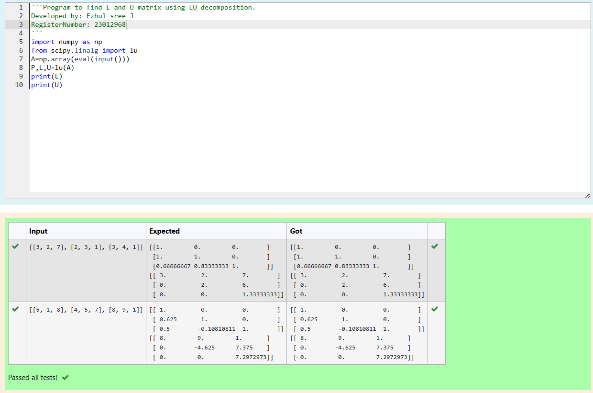
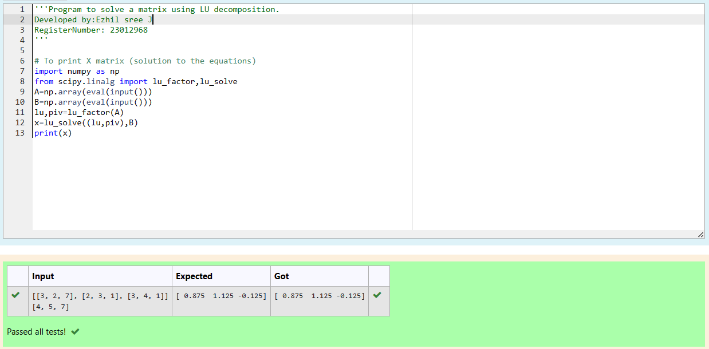

# LU Decomposition 

## AIM:
To write a program to find the LU Decomposition of a matrix.

## Equipments Required:
1. Hardware – PCs
2. Anaconda – Python 3.7 Installation / Moodle-Code Runner

## Algorithm
## L and U matrix using LU decomposition
1. Import the required libraries: 'numpy' and 'scipy.linalg.'
2. Receive a matrix input from the user and convert it into a NumPy array using 'numpy.array(eval(input())).'
3. Use the 'lu' function from 'scipy.linalg' to perform LU decomposition on the input matrix.
4. Assign the output matrices (P, L, U) to variables.
5. Print the L and U matrix using print(L) and print(U).
## LU Decomposition of a matrix
1. Import the necessary libraries: 'numpy' and 'scipy.linalg.'
2. Receive two matrices (A and B) as input from the user and convert them into NumPy arrays using 'numpy.array(eval(input()))'.
3. Use the 'lu_factor' function from 'scipy.linalg' to obtain the LU decomposition of matrix A.Assign the LU factorization and pivot information to variables 'lu' and 'piv'.
4. Use the 'lu_solve' function with the LU factorization and pivot information to solve the system of linear equations.Assign the result to variable 'x'.
5. Print the solution matrix 'x' using 'print(x)'.


## Program:
(i) To find the L and U matrix
```py
'''Program to find L and U matrix using LU decomposition.
Developed by: Ezhil sree J
RegisterNumber: 23012968
'''
import numpy as np
from scipy.linalg import lu
A=np.array(eval(input()))
P,L,U=lu(A)
print(L)
print(U)
```
(ii) To find the LU Decomposition of a matrix
```py
'''Program to solve a matrix using LU decomposition.
Developed by:Ezhil sree J
RegisterNumber: 23012968
'''

# To print X matrix (solution to the equations)
import numpy as np
from scipy.linalg import lu_factor,lu_solve
A=np.array(eval(input()))
B=np.array(eval(input()))
lu,piv=lu_factor(A)
x=lu_solve((lu,piv),B)
print(x)
```

## Output:



## Result:
Thus the program to find the LU Decomposition of a matrix is written and verified using python programming.

